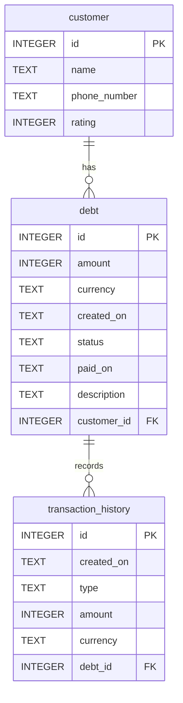

Debt Manager

this project manage debt for small businesses to keep track of customer and their debts
1. user can add customer 
2. user can edit customer
3. user can delete a customer
4. customer has :
   * id
   * name 
   * phone_number
   * rating
5. debt has :
   * id 
   * amount 
   * currency
   * created_on 
   * status(paid/unpaid/canceled)
   * customer_id
   * paid_on  
   * description
6. transaction_history has:
   * id 
   * created_on 
   * type(refund, full_payment,partial_payment)
   * debt_id
   * amount
   * currency

